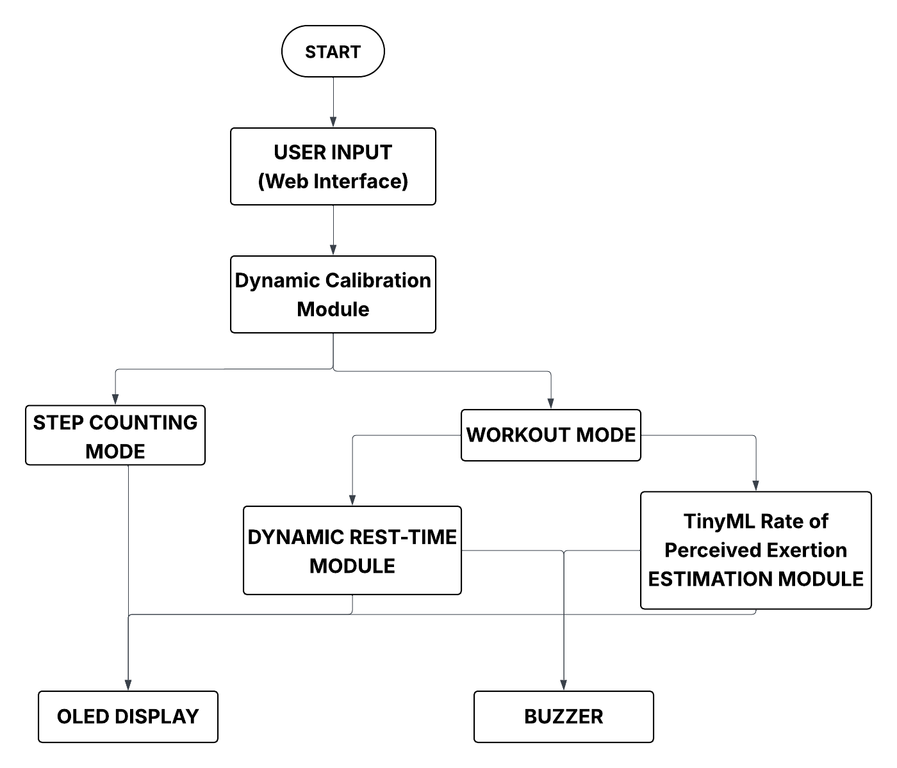

# Adaptive Embedded Fitness Wearable with TinyML-Based RPE Estimation

An ESP32-based intelligent fitness wearable that performs on-device exercise detection, repetition counting, step tracking, and fatigue-aware adaptation using motion sensing, heart-rate dynamics, and TinyML.

The system operates as a fully standalone embedded device — with no smartphone or cloud dependency — and dynamically personalizes itself to each user through unified motion calibration and learned exertion modeling.

---

## TinyML-Based RPE Estimation

The wearable estimates **Rate of Perceived Exertion (RPE)** using an on-device TinyML model that learns the relationship between motion dynamics, heart-rate response, and workout context.

Instead of relying solely on fixed heart-rate thresholds, the system extracts higher-level features such as:
- Motion energy and rep-to-rep variance from IMU data
- Heart-rate peak, rise slope, and recovery rate
- Set duration and temporal fatigue accumulation

These features are fed into a lightweight TinyML regression model deployed directly on the ESP32, producing a continuous RPE score (1–10) after each set.

The estimated RPE is used to:
- Automatically adapt rest duration
- Detect early fatigue or overexertion
- Enable personalized, effort-aware workout progression

All inference is performed **on-device**, ensuring low latency, user privacy, and standalone operation.

---

## Hardware
- ESP32 microcontroller  
- MPU6050 (Accelerometer + Gyroscope)  
- MAX30102 Heart Rate Sensor  
- OLED Display  
- Capacitive Touch Sensor  
- Piezo Buzzer  

---

## Key Concepts
- State-machine-driven embedded firmware
- Motion + gyroscope fusion for exercise detection
- Unified, user-specific calibration
- Hybrid RPE estimation (rule-based baseline + TinyML inference)
- Heart-rate–aware adaptive recovery logic
- Fully standalone on-device intelligence

---

## Modes of Operation
- **Configuration Mode** – Web-based workout setup via WiFi
- **Calibration Mode** – One-time unified motion calibration
- **Workout Mode** – Real-time exercise detection and rep counting
- **Rest Mode** – Heart-rate and RPE–aware recovery control
- **RPE Estimation Mode** – TinyML-based perceived exertion inference
- **Step Counting Mode** – Continuous background activity tracking

---

## System Architecture

The firmware follows a **state-machine-driven architecture**, ensuring deterministic behavior, clean mode transitions, and non-blocking real-time execution across sensing, inference, and user interaction tasks.

---

## Author

**Harshvardhan Rajkumar**  
Final Year B.Tech – Electronics & Computer Engineering
